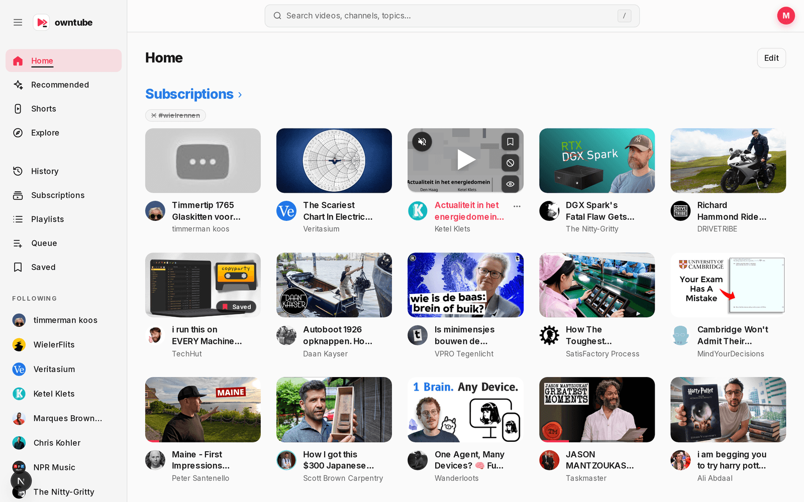
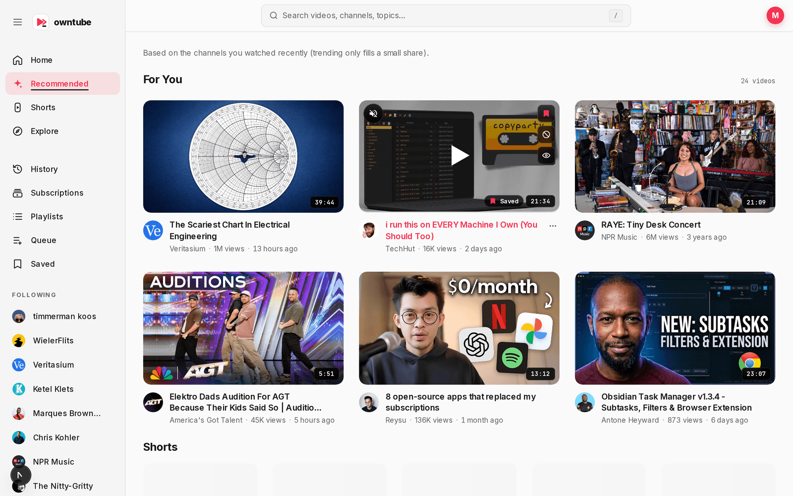
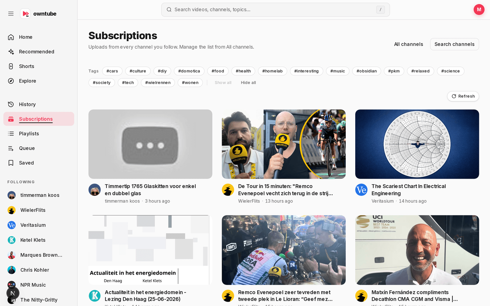
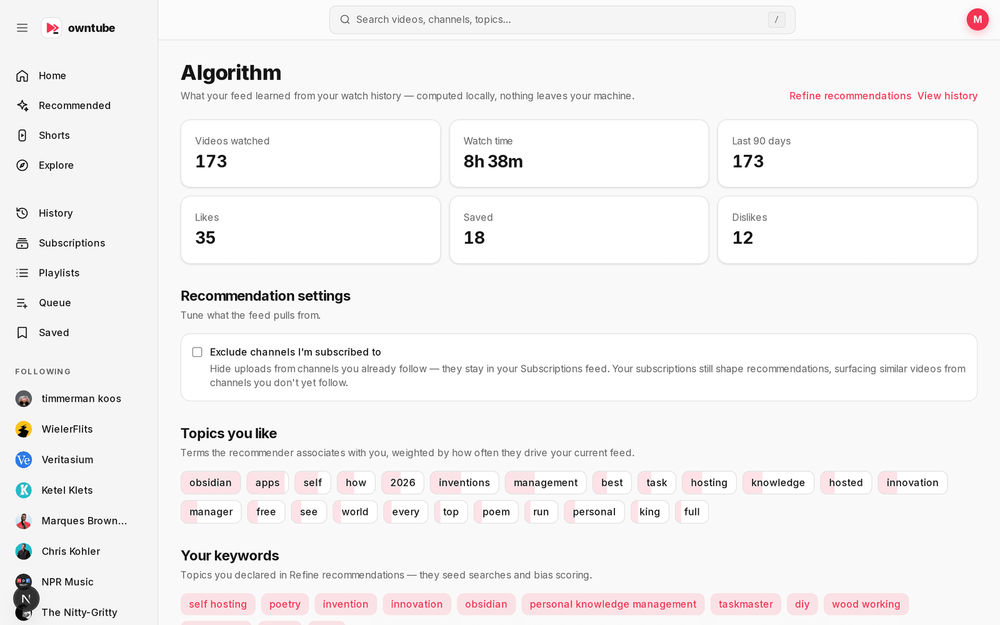
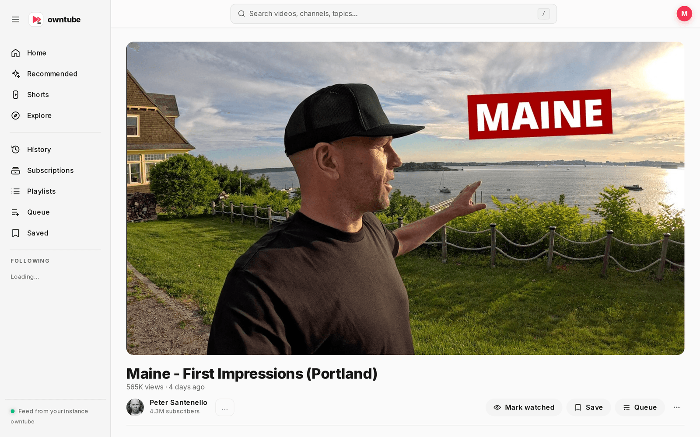
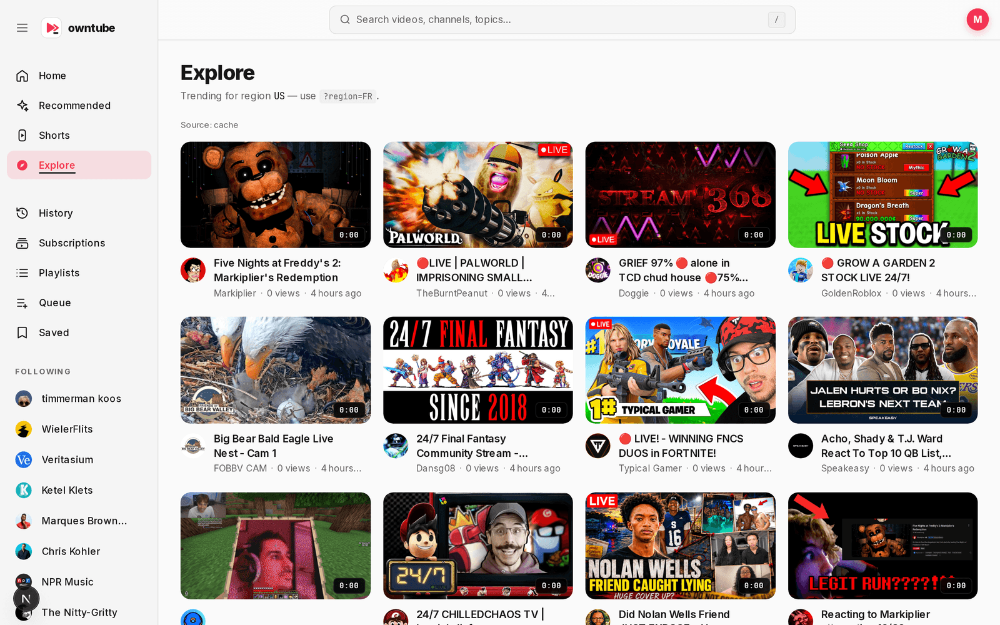

# OwnTube

Self-hosted, privacy-first YouTube frontend. No Google APIs, no tracking, no telemetry. Video metadata and streams come from **Piped** and/or **Invidious**, and a small content-based recommender runs on top of your own watch history (stored locally in SQLite).

It's a solo side-project. Code is meant to stay maintainable by one person, so the stack is intentionally small and boring: Next.js 15 + TypeScript + tRPC + Drizzle + SQLite.



## Features

- **Customizable modular home** — reorderable blocks (subscriptions, recommended, explore, history, queue, saved, playlists) with per-block layout, size, tag filters, and color-coded headers
- Search, watch, history, like / dislike / save
- Personal recommendation feed (TF-IDF + MMR diversification, no collaborative filtering) with a local **Algorithm** dashboard, keyword refinement, and an option to keep already-subscribed channels out of recommendations
- Trending ("Explore") page, channel pages, subscriptions with merged feed and tri-state tag filters
- Auth.js (credentials + bcrypt), multi-user accounts
- Theme switcher, per-user Piped/Invidious overrides, JSON export/import
- PiP and keyboard shortcuts in the player (Vidstack)
- Local playlists, dashboard stats, YouTube Takeout history import
- PWA (manifest + service worker)
- Docker Compose with healthcheck and restart policy

## Screenshots

|                                                                    |                                                                    |
| ------------------------------------------------------------------ | ------------------------------------------------------------------ |
| **Recommended** — personalized "For You" feed                      | **Subscriptions** — merged uploads with tri-state tag filters      |
| [](docs/screenshots/recommended.png) | [](docs/screenshots/subscriptions.png) |
| **Algorithm** — local recommender insights & settings              | **Watch** — Vidstack player                                        |
| [](docs/screenshots/dashboard.png) | [](docs/screenshots/watch.png) |
| **Explore** — regional trending                                    |                                                                    |
| [](docs/screenshots/trending.png) |                                                                    |

## Requirements

- Node.js 22+
- [corepack](https://nodejs.org/api/corepack.html) (ships with Node) for pnpm
- A reachable Piped or Invidious instance — public or self-hosted (see [docs/SELF-HOSTING.md](docs/SELF-HOSTING.md))

This is a pnpm workspace: the web app lives in `apps/web/` and the (work-in-progress) TV client in
`apps/tv/`. Self-hosting only ever needs `apps/web/`; the Docker image never contains TV code. The
root scripts below delegate to the web app via `pnpm --filter web`.

## Quick start

```bash
cp apps/web/.env.example apps/web/.env
corepack enable && corepack prepare pnpm@9.15.9 --activate
pnpm install
pnpm run db:migrate
pnpm dev
```

Open <http://localhost:3000>. Register an account on `/register` and you're in.

## Docker

```bash
docker compose up --build
```

Set `PIPED_BASE_URL`, `INVIDIOUS_BASE_URL` and `AUTH_SECRET` in `.env` (or in the compose `environment:` block). The SQLite database is persisted in the named volume `owntube-data`.

For Unraid deployment, use `docker-compose.unraid.yml` + `.env.unraid` and follow [docs/UNRAID-DEPLOYMENT.md](docs/UNRAID-DEPLOYMENT.md).

For a fully local setup with a self-hosted Invidious, run `bash scripts/setup-invidious.sh` and follow [docs/SELF-HOSTING.md](docs/SELF-HOSTING.md).

## Routes

| Route                   | What                                              |
| ----------------------- | ------------------------------------------------- |
| `/`                     | Customizable modular home (signed-out → `/recommended`) |
| `/recommended`          | Personalized recommendation feed (falls back to trending) |
| `/trending`             | Regional trending ("Explore")                     |
| `/subscriptions`        | Subscribed channels + merged latest uploads       |
| `/channel/:channelId`   | Channel profile and videos                        |
| `/search`               | Video search                                      |
| `/watch/:videoId`       | Player + related videos                           |
| `/history`              | Watch history (signed-in)                         |
| `/playlists`            | Local playlists                                   |
| `/queue`, `/saved`      | Watch queue and saved videos                      |
| `/dashboard`            | Algorithm — recommender insights, keywords, settings |
| `/settings`             | Theme, source instances, JSON export/import       |
| `/login`, `/register`   | Credentials auth                                  |

## Scripts

| Script              | Description                                         |
| ------------------- | --------------------------------------------------- |
| `pnpm dev`          | Next.js dev server (Turbopack)                      |
| `pnpm build`        | Production build                                    |
| `pnpm start`        | Production server                                   |
| `pnpm lint`         | Biome check                                         |
| `pnpm format`       | Biome format (write)                                |
| `pnpm typecheck`    | `tsc --noEmit`                                      |
| `pnpm db:migrate`   | Apply SQLite migrations                             |
| `pnpm db:generate`  | Regenerate migrations from the Drizzle schema       |
| `pnpm db:studio`    | Drizzle Studio                                      |
| `pnpm test`         | Vitest unit tests                                   |
| `pnpm test:watch`   | Vitest in watch mode                                |
| `pnpm test:e2e`     | Playwright (`e2e/`); first run: `pnpm exec playwright install` |

## Environment

All variables are documented in [.env.example](.env.example). The most important ones:

- `DATABASE_PATH` — SQLite file (default `./data/owntube.db`)
- `PIPED_BASE_URL` — Piped API base, or `disabled` to skip Piped entirely
- `INVIDIOUS_BASE_URL` — Invidious API base (used as fallback, or as the only source if Piped is disabled)
- `AUTH_SECRET` — Auth.js JWT secret (**must** be set in production)
- `LOG_LEVEL` — `debug` / `info` / `warn` / `error`

## Project layout

```
src/
  app/                 Next.js App Router (pages, route handlers, providers)
  components/          UI by feature (player, search, channel, settings, …)
  lib/                 Pure utilities (proxies, parsers, formatters, helpers)
  server/
    auth.ts            Auth.js v5 setup
    db/                Drizzle schema + SQL migrations
    errors/            Typed error classes
    recommendation/    Reco engine: signals, TF-IDF, scoring, MMR, cold-start
    services/          Piped/Invidious proxy + rate limiter
    settings/          User profile / settings logic
    subscriptions/     Channel-id reconciliation helpers
    trpc/              tRPC routers, context, root
  stores/              Zustand stores (theme, …)
  trpc/                Client-side tRPC + React Query setup
docs/
  SELF-HOSTING.md      Self-hosted Invidious / Piped guide + backup cron
e2e/                   Playwright tests
scripts/               Setup + migration scripts
```

## Tech stack

- **Framework**: Next.js 15 (App Router only)
- **Language**: TypeScript (strict)
- **UI**: Tailwind v4 + shadcn/ui (Radix), Vidstack player
- **State**: Zustand
- **API**: tRPC v11 + TanStack Query
- **DB**: SQLite via `better-sqlite3` + Drizzle ORM
- **Auth**: Auth.js v5 (Credentials + bcrypt)
- **Validation**: Zod
- **Tests**: Vitest + Playwright
- **Lint/format**: Biome
- **Package manager**: pnpm

## Contributing

PRs and issues are welcome. Please read [CONTRIBUTING.md](CONTRIBUTING.md) before opening one. For security-sensitive reports, see [SECURITY.md](SECURITY.md).

## License

MIT — see [LICENSE](LICENSE).
